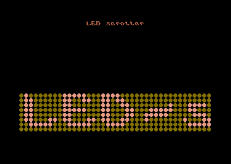

= C64 demo "Red Led Scroll"

The first real program I tried out for C64 (6510 processor) assembler programming.

https://vimeo.com/756522273[Red LED scroll] clip on Vimeo.

== How to build and run

== Binaries

Precompiled binaries are found in `bin` directory either as a `prg`-file or as a `d64`-file (a C64 floppy disc image).

Load them in your favourite C64 emulator.